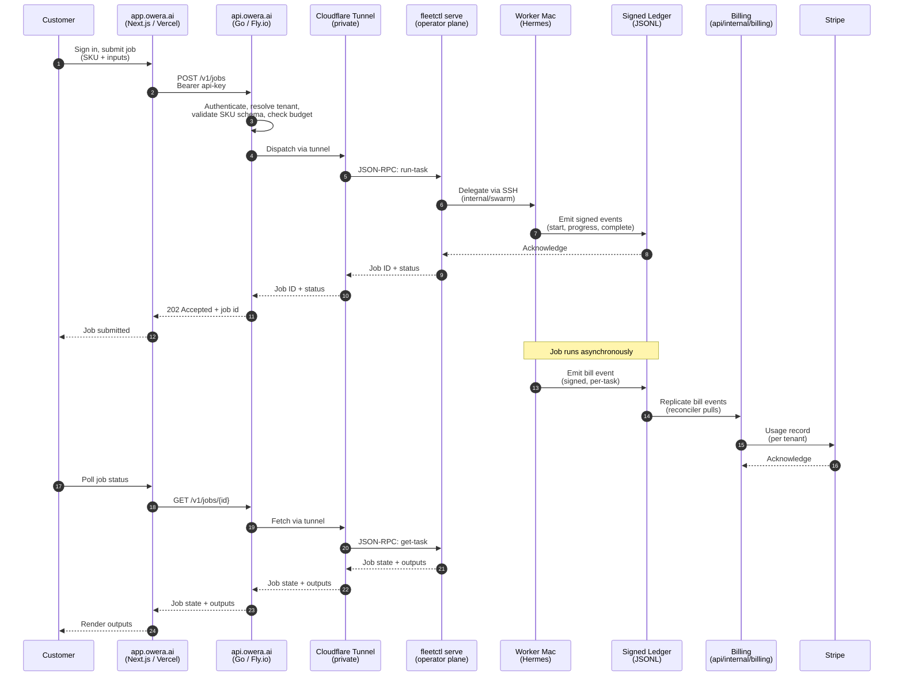

# Architecture

> **Audience: operators and contributors.** This is the load-bearing diagram and prose for "how does Owera Agentic actually work end-to-end."

## Two planes

Owera Agentic is built on a deliberate two-plane split. The customer plane (this repo) is what customers see; the operator plane (`owera-fleet`) is what runs the work. The two never share a single failure domain.

| Plane | Repo | Surface | Runtime | What it owns |
|---|---|---|---|---|
| Customer | `owera-cloud` | `api.owera.ai`, `app.owera.ai`, `status.owera.ai` | Fly.io (api) + Vercel (web) + Cloudflare (DNS/tunnel) | Identity, billing, dashboard, status page, compliance log. |
| Operator | `owera-fleet` | private — never customer-facing | macOS Mac mini gateway + worker Macs in Macapá | Hermes agents, signed ledger, swarm orchestrator, JSONL logs, LaunchAgents. |

The seam: the operator plane exposes a minimal JSON-RPC endpoint (`fleetctl serve`) reachable only through a private Cloudflare Tunnel. The customer plane's dispatcher dials in over that tunnel. The tunnel is the single, authenticated, audited point of contact between the two planes.

## Request lifecycle

A customer submits a job, the cloud accepts it, the operator plane runs it, the ledger emits a bill event, and Stripe records usage. Every step writes to the audit log.



## Component map

```text
Customer plane (this repo)              Operator plane (owera-fleet)
+-----------------------------+         +-----------------------------+
| web/ (Next.js dashboard)    |         | fleetctl (Go dispatcher)    |
|   - app/dashboard           |         |   - delegate                |
|   - app/jobs                |         |   - swarm                   |
|   - app/billing             |         |   - ledger                  |
|   - app/api-keys            |         |   - audit                   |
+--------------+--------------+         +--------------+--------------+
               |                                       |
               v                                       v
+-----------------------------+         +-----------------------------+
| api/ (Go HTTP gateway)      |  CF     | fleetctl serve              |
|   - auth                    | tunnel  |   (JSON-RPC on private port)|
|   - identity                |<------->|                             |
|   - catalog                 |         |                             |
|   - jobs                    |         |                             |
|   - dispatcher              |         | internal/                   |
|   - billing                 |         |   - ledger (minisigned)     |
|   - audit                   |         |   - pairing                 |
|   - status                  |         |   - budget                  |
+--------------+--------------+         |   - orchestrator            |
               |                        |   - hermesjobs              |
               v                        |   - markers                 |
        +-------------+                 |   - alerting                |
        | Stripe      |                 |   - metrics                 |
        | (usage)     |                 +--------------+--------------+
        +-------------+                                |
                                                       v
                                       +-----------------------------+
                                       | Worker Macs (Hermes agents) |
                                       |   - Hermes runtime          |
                                       |   - LaunchAgents            |
                                       |   - JSONL logs              |
                                       +-----------------------------+
```

## Failure isolation

Three independent failure domains:

1. **Customer plane up, operator plane down.** API returns `503` with `Retry-After`. Dashboard renders cached job state with a "queue paused" banner. No retries hammer the tunnel. When the tunnel recovers, queued jobs resume.
2. **Operator plane up, customer plane down.** The fleet keeps processing in-flight jobs. The ledger keeps emitting bill events. On customer-plane recovery, the dashboard catches up from the ledger replay.
3. **Tunnel down, both planes up.** Same as case 1 from the customer's perspective. The fleet drains its queue without accepting new work.

## Data residency

- API and dashboard hosting: Fly.io `gru` (São Paulo) primary; Vercel multi-region (`gru1`, `iad1`).
- Operator plane: physically in Macapá, Brazil.
- Customer data at rest: encrypted in Fly.io Postgres (gru) and on the operator plane's encrypted volumes.
- Stripe: US-based; tenant metadata (email, name, tenant ID) is replicated to Stripe; jobs and ledger events are not.
- EU customers: data is processed in Brazil under SCCs. See [`compliance.md`](compliance.md).

## Where to read more

- [`api.md`](api.md) — customer-facing API surface.
- [`pricing.md`](pricing.md) — what the API charges for and how.
- [`compliance.md`](compliance.md) — LGPD, SOC 2, data residency in detail.
- [`runbook-deploy.md`](runbook-deploy.md) — how to deploy this stack.
- [`../infra/`](../infra/) — IaC manifests for each tier.
- `owera-fleet/docs/operation.md` — the operator-plane architecture in detail.
